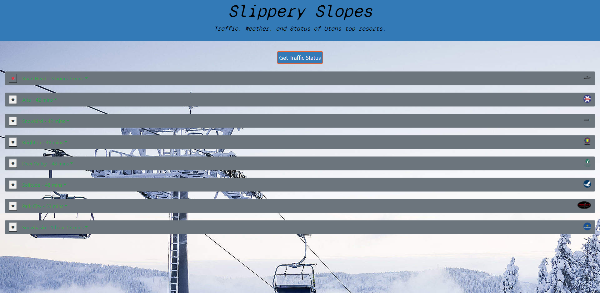

# Project1

# Slippery Slopes README
## Requirements 

* Build a simple weather application
* This app will run in the browser
* Use the OpenWeather API to retrieve weather data for cities
* Show current and future conditions for a searched city and add it to the search history
* Display city name, the date, an icon representation of weather conditions, the temperature, the humidity, the wind speed, and the UV index
* Use color to show if the UV index is favorable, moderate, or severe
* Display 5-day forecast with the date, an icon representation of weather conditions, the temperature, and the humidity
* Click on a city in the search history and show current and future conditions for that city
* On subsequent opens display last searched city forecast
  
# Project1 Aim

* to enable Utah skiers and snowboarders to search surrounding resorts based on user location. 
To each surrounding resort, it provides real-time updates regarding the weather, current traffic, and the lift access available. 

# Technologies Used

* Visual Studio Code 
* Slack
* GitHub Team Repository
* Google API Calls
* lifty API - Ski Resort Data
* Google Slides
* GitHub
* Zoom.us

# Team Responsiblities 
* Chance Ewell - README.md / Google Slides / Project Proposal 
* Derrick DeVilliers - Bootstrap Layout / CSS Grid / HTML 
* Jorgen Tuck - JavaScript / jQuery / API Calls / Hosting 
* Juan Boza - Style.CSS / Mobile Responsive layout 

# Challenges

* Local Storage Favorite Locations
* set users location to global variables and trigger the Google directions API call function

# Scope of Functions 
* resort array
* array to store API responses
* lat and lon for the users location
* calls the Liftie API and stores results
* populate object and push to the array
* function to reorder the objects an array based on name
* function to reorder the objects an array based on distance
* Google directions API call
* console.log(response.routes[0].legs[0].end_location.lat);
* function to get users location
* set users location to global variables and trigger the Google directions API call function
* function to display resort stats
* $('#drop' + id).text(resortObj[i].lifts.liftStatus[0]);
* console.log(key + ' is ' + value);
* color duration based on traffic
* update favorites in the array and save to local storage
* remove from local storage so we don't have more than one entry
* re save updated array to local storage
* remove from local storage so we don't have more than one entry
* re save updated array to local storage
* what to do when all running ajax calls finish
* click events
* search by location button click
* cardEl.removeClass('d-none');
* runs after the page loads

# Examples of use 
* As a Skier/Snowboarder, I want a simple to use app that will give me current info about ski resorts nearest to me. I want to know about traffic, resort status and current weather before I make the trek up the canyon.

# Description 
* Slippery Slopes is designed to enable Utah skiers and snowboarders to search surrounding resorts based on user location. 
To each surrounding resort, it provides real-time updates regarding the weather, current traffic, and the lift access available. 

# Launch
* 50 + Commits 
* 40 + Hours Build Time
* Hosted on Oct, 31 2020 
  
# Programing Languages
* html
* CSS
* JavaScript
* jQuery
* JSON
  
## Files & directories
* index&#46;html
* script&#46;js
* style&#46;css
* README&#46;md

## Links
#####[Link to webpage](https://jamesjtuckbc.github.io/Slippery-Slopes/)
#####[Link to repo](https://github.com/jamesjtuckbc/Slippery-Slopes)
### Pages
#### index.html

- - -
© 2020 Jorgen Tuck, Derrick Devilliers, Juan Boza, Chance Ewell
